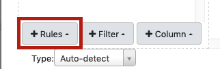

Once you know how to access to your Metavisitor Galaxy instance with a web browser and are able to perform basic start/stop/restart operations, there is still some work needed to import and configure reference data (genomes) so that they are directly available to all instance users for running tools and workflows.

Here we provide the step-by-step description of what we *actually did ourselves* to prepare our Metavisitor instance before performing the analyses described [here](http://dx.doi.org/10.1101/048983).

## 1. Connect to your Metavisitor Galaxy admin account with your web browser

## 2. Import reference data in an history "References"

At first, you need to import and prepare the reference datasets you will need for most of the Metavisitor analyses. As a Galaxy admin you will make latter some of these references directly accessible to the Galaxy tools, and/or accessible to any other users by putting them in a Galaxy public library.

#### a. Preliminary actions
Click on the `Analyze Data` menu
rename the `Unnamed history` to `References`

#### b. Upload nucleotide vir2 fasta file

- Click on the  button on top of the tool bar (left handside of the Galaxy interface)
- In the open window, click on the `Rule-based` tab 
- Make sure "Upload data as:" is set to datasets and "Load tabular data from:" is set to Pasted Table
- Copy - paste the following table (not including the header)

Name              | URL
------------------|----
`nucleotide vir2` | https://ndownloader.figshare.com/files/11005121
`protein vir2`    | https://ndownloader.figshare.com/files/11005124
`dm6`             | ftp://ftp.flybase.net/genomes/Drosophila_melanogaster/dmel_r6.10_FB2016_02/fasta/dmel-all-chromosome-r6.10.fasta.gz
`AgamP4`          | https://www.vectorbase.org/sites/default/files/ftp/downloads/Anopheles-gambiae-PEST_CHROMOSOMES_AgamP4.fa.gz
`P. berghei`      | ftp://ftp.ensemblgenomes.org/pub/release-28/protists/fasta/plasmodium_berghei/dna/Plasmodium_berghei.May_2010.28.dna_sm.genome.fa.gz
`hg19`            | ftp://ftp.ensembl.org/pub/release-84/fasta/homo_sapiens/dna/Homo_sapiens.GRCh38.dna.primary_assembly.fa.gz

- Click on the `Build` button on the bottom right
- Click on the `+ Rules` button on the bottom left 
- Select `Add / Modify Column Definitions` from the list
- Click the `+ Add Definition` button, then select `Name` from the list and set column "A" as Name column
- Click the `+ Add Definition` button, select `URL` and set the "B" column as URL column
- Click the `Apply` button. Finally click the `Upload` button in the bottom right

The reference genomes should be uploaded shortly to Galaxy.

## 3. Prepare Blast databases

- Use the tool `NCBI BLAST+ makeblastdb`

What to set in each form field for | nucleotide vir2             | protein vir2
-----------------------------------|-----------------------------|-------------
Molecule type of input             | nucleotide                  | protein     
Input FASTA files(s)               | dataset 1 (nucleotide vir2) | dataset 2 (protein vir2)
Title for BLAST database           | nucleotide vir2 blastdb     | protein vir2 blastdb

- Leave the rest of the form unchanged and click the `Execute` button
- Rename the generated datasets "*nucleotide vir2 blast database*" and "*protein vir2 blast database*" for clarity

## 4. Creating Galaxy dbkey and fasta references accessible to tools for every user

Be sure that the `References` history is selected in the background, otherwise the uploaded genomes will not be available.

- Go to the `admin` panel
- Click `Local data` in the left menu
- Select the `Create DBKey and Reference Genome` in the "**Data Managers**" table

What to set in each form field for         | nucleotide vir2 | dm6     | AgamP4  | hg19
-------------------------------------------|-----------------|---------|---------|-----
Use existing dbkey or create a new one     | New             | New     | New     | New
dbkey                                      | vir2            | dm6     | AgamP4  | hg19
Choose the source for the reference genome | History         | History | History | History
FASTA file                                 | nucleotide vir2 | dm6     | AgamP4  | hg19

- Leave the rest of the fields empty and click the `Execute` button

## 5. Creating Galaxy bowtie indexes accessible to tools for every user
Now we are going to generate the bowtie indexes using another data manager tool.

#### a. vir2 bowtie index
Now, go back to your web browser and the `admin` panel, click again `Local data` in the left menu and  select this time the `Bowtie index - builder` in the "**Run Data Manager Tools**" (top section).

Select "vir2" in the `Source FASTA Sequence` menu of the Bowtie index builder tool form, leave the other options empty, and click execute.

#### b. dm6 bowtie index
Go back to your web browser and the `admin` panel, click again `Local data` in the left menu and  select this time the `Bowtie index - builder` in the "**Run Data Manager Tools**" (top section).

Select "dm6" in the `Source FASTA Sequence` menu of the Bowtie index builder tool form, leave the other options empty, and click execute.

#### c. AgamP4 bowtie index
Go back to your web browser and the `admin` panel, click again `Local data` in the left menu and  select this time the `Bowtie index - builder` in the "**Run Data Manager Tools**" (top section).

Select "AgamP4" in the `Source FASTA Sequence` menu of the Bowtie index builder tool form, leave the other options empty, and click execute.

#### d. hg19 bowtie index
Go back to your web browser and the `admin` panel, click again `Local data` in the left menu and  select this time the `Bowtie index - builder` in the "**Run Data Manager Tools**" (top section).

Select "hg19" in the `Source FASTA Sequence` menu of the Bowtie index builder tool form, leave the other options empty, and click execute.

----
#### Note that the preparation of bowtie indexes can be long ! (several hours for the vir2 bowtie index for instance)

## 6. Creating Galaxy bowtie2 indexes accessible to tools for every user
Finally, we are going to generate the bowtie2 indexes using another data manager tool.

----
#### a. vir2 bowtie2 index
Now, Go back to your web browser and the `admin` panel, click again `Local data` in the left menu and  select this time the `Bowtie2 index - builder` in the "**Run Data Manager Tools**" (top section).

Select "vir2" in the `Source FASTA Sequence` menu of the Bowtie index builder tool form, leave the other options empty, and click execute.

#### b. AgamP4 bowtie2 index
Go back to your web browser and the `admin` panel, click again `Local data` in the left menu and  select this time the `Bowtie2 index - builder` in the "**Run Data Manager Tools**" (top section).

Select "AgamP4" in the `Source FASTA Sequence` menu of the Bowtie index builder tool form, leave the other options empty, and click execute.

#### c. hg19 bowtie2 index
Go back to your web browser and the `admin` panel, click again `Local data` in the left menu and  select this time the `Bowtie2 index - builder` in the "**Run Data Manager Tools**" (top section).

Select "hg19" in the `Source FASTA Sequence` menu of the Bowtie index builder tool form, leave the other options empty, and click execute.

----
#### Note that the preparation of bowtie2 indexes can be long too ! (several hours for the vir2 bowtie2 index for instance)
